# Delta Neutral Hook

Delta Neutral Hook is a Uniswap v4 project exploring how a market-making pool
can account for inventory risk on-chain, expose hedge intent to an external
keeper, and use dynamic fees to guide order flow while the system returns toward
delta neutrality.

The project has grown from a single capstone hook into a two-generation,
dual-deployment system: a v1 hook for Ethereum Sepolia that establishes the core
accounting and intent model, and a production-grade v2 hook on Base Sepolia that
adds collateral management, LP inventory tracking, async hedge orders, and a
multi-mode health state machine. Both generations are served by the same
TypeScript keeper (operating in `capstone` or `production` mode), an operator
frontend built on Next.js, RainbowKit, and wagmi, and a local live-orchestration
arena capable of running multi-wallet showcase demos with realistic stress
scenarios including defensive mode recovery.

## Table of Contents

1. [Motivation](#motivation)
2. [Repository Layout](#repository-layout)
3. [System Overview](#system-overview)
4. [The Hook Evolution](#the-hook-evolution)
5. [DeltaNeutralHook — v1 Capstone](#deltaneutralhook--v1-capstone)
6. [ProductionDeltaNeutralHook — v2 Production](#productiondeltaneutralhook--v2-production)
7. [Adapter Layer](#adapter-layer)
8. [Liquidity Router](#liquidity-router)
9. [The Keeper](#the-keeper)
10. [Frontends](#frontends)
11. [Deployments](#deployments)
12. [Running The Contracts](#running-the-contracts)
13. [Running The Keeper](#running-the-keeper)
14. [Running The Frontends](#running-the-frontends)
15. [Testing](#testing)
16. [Suggested Review Flows](#suggested-review-flows)
17. [Limitations And Next Steps](#limitations-and-next-steps)

## Motivation

Traditional market makers are constantly managing inventory. If a pool becomes
long or short the base asset after swaps, its LPs are exposed to directional
price movement. A delta-neutral strategy tries to offset that exposure with an
external hedge, such as a perp, CEX, or lending-market position.

Uniswap v4 hooks make this design space interesting because a hook can sit
directly on the pool lifecycle. It can observe swaps, update risk accounting,
alter fees, and emit machine-readable intent without taking custody of an
external hedge venue. This project uses that hook surface to model a hybrid
on-chain/off-chain market maker:

- The hook owns pool inventory accounting, fee policy, and (in v2) collateral
  safety.
- The keeper owns external hedge coordination: deciding when to rebalance,
  committing orders, and settling them once the venue's settlement window is
  reached.
- The adapter layer abstracts the hedge venue — today a controllable demo
  adapter, tomorrow Synthetix V3 perps or any other protocol with a matching
  interface.
- The operator frontend makes the accounting loop visible with live risk reads,
  role-gated actions, and a dynamic fee preview.
- The live arena drives the whole stack with realistic multi-wallet traffic to
  stress-test the system end-to-end, including defensive mode injection and
  recovery.

## Repository Layout

```
src/
  DeltaNeutralHook.sol                     v1 capstone hook
  ProductionDeltaNeutralHook.sol           v2 production hook
  DemoERC20.sol                            mock token used in both deployments
  adapters/
    DemoHedgeAdapter.sol                   injectable adapter with controllable state
    MockHedgeAdapter.sol                   minimal no-op adapter for unit tests
    SynthetixV3HedgeAdapter.sol            Synthetix V3 perps integration
  interfaces/
    IHedgeAdapter.sol                      adapter interface
    IERC20Minimal.sol                      minimal ERC20 surface
    ISynthetixV3PerpsAdapter.sol           Synthetix V3 proxy interface
  libraries/
    HookAddressMiner.sol                   CREATE2 address mining for v4 flags
  routers/
    ProductionStrategyLiquidityRouter.sol  operator-restricted LP router

script/
  DeploySepolia.s.sol                      Sepolia capstone deployment
  DeployProductionBaseSepolia.s.sol        Base Sepolia production deployment

keeper/
  src/
    index.ts          entry point, keeper loop (capstone + production modes)
    risk.ts           decision logic and type definitions
    deployment.ts     deployment JSON loader and PoolKey builder
    abi.ts            contract ABIs
    env.ts            environment variable loading
    demo.ts           demo adapter control helpers
    recoverProductionSnapshot.ts  snapshot recovery utility

frontend/
  src/
    app/              Next.js app router (layout, page, providers)
    components/       Dashboard component (main operator UI)
    generated/        deployment JSONs consumed by wagmi contract reads
    lib/              shared utilities

live-demo/
  src/
    app/              Vite + React dashboard
    server/           Express orchestration server (12 modules)
    shared/           shared types between server and app
  scripts/
    dev.mjs           start both api + web concurrently
    dev-fork.mjs      start in local Anvil fork mode
    fork-anvil.mjs    spawn Anvil fork process
    fork-env.mjs      fork environment helpers

deployments/
  sepolia.json                  Sepolia contract addresses and pool config
  base-sepolia-production.json  Base Sepolia contract addresses and pool config

docs/
  architecture-walkthrough.md   step-by-step visual tour of both hooks

test/
  DeltaNeutralHook.t.sol
  ProductionDeltaNeutralHook.t.sol
  HookAddressMiner.t.sol
  ProductionDemoContracts.t.sol
```

## System Overview

The full system spans two hook generations, two networks, and three runnable
processes (keeper, operator frontend, live arena). Everything outside the smart
contracts is off-chain and communicates with the chain only through standard RPC
calls.

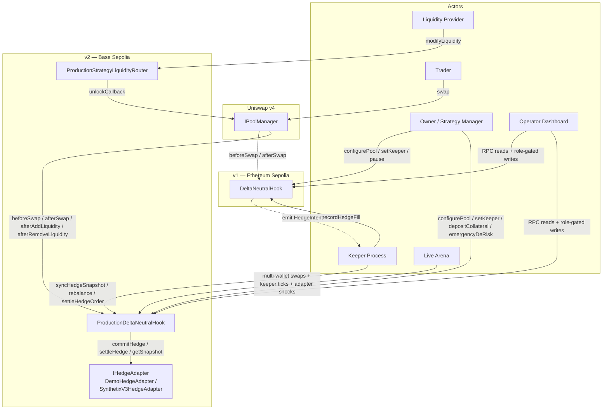
```mermaid
graph TD
    subgraph Actors
        Owner["Owner / Strategy Manager"]
        Keeper["Keeper Process"]
        Trader["Trader"]
        LP["Liquidity Provider"]
        Operator["Operator Dashboard"]
        Arena["Live Arena"]
    end

    subgraph "Uniswap v4"
        PM["IPoolManager"]
    end

    subgraph "v1 — Ethereum Sepolia"
        V1["DeltaNeutralHook"]
    end

    subgraph "v2 — Base Sepolia"
        V2["ProductionDeltaNeutralHook"]
        Adapter["IHedgeAdapter\nDemoHedgeAdapter /\nSynthetixV3HedgeAdapter"]
        Router["ProductionStrategyLiquidityRouter"]
    end

    Owner -->|"configurePool / setKeeper / pause"| V1
    Owner -->|"configurePool / setKeeper / depositCollateral / emergencyDeRisk"| V2
    Trader -->|"swap"| PM
    LP -->|"modifyLiquidity"| Router
    Router -->|"unlockCallback"| PM
    PM -->|"beforeSwap / afterSwap"| V1
    PM -->|"beforeSwap / afterSwap / afterAddLiquidity / afterRemoveLiquidity"| V2
    V1 -.->|"emit HedgeIntent"| Keeper
    Keeper -->|"recordHedgeFill"| V1
    Keeper -->|"syncHedgeSnapshot / rebalance / settleHedgeOrder"| V2
    V2 -->|"commitHedge / settleHedge / getSnapshot"| Adapter
    Operator -->|"RPC reads + role-gated writes"| V1
    Operator -->|"RPC reads + role-gated writes"| V2
    Arena -->|"multi-wallet swaps + keeper ticks + adapter shocks"| V2
```

### Component Summary

| Component | Language | Purpose |
|---|---|---|
| `DeltaNeutralHook` | Solidity 0.8.26 | v1 capstone hook: accounting, fee policy, hedge intent |
| `ProductionDeltaNeutralHook` | Solidity 0.8.26 | v2 production hook: all of v1 plus collateral, LP tracking, async orders, health modes |
| `SynthetixV3HedgeAdapter` | Solidity 0.8.26 | Hedge adapter wired to Synthetix V3 perps proxy |
| `DemoHedgeAdapter` | Solidity 0.8.26 | Injectable adapter with controllable state for demos and showcase |
| `MockHedgeAdapter` | Solidity 0.8.26 | Minimal no-op adapter for Foundry unit tests |
| `ProductionStrategyLiquidityRouter` | Solidity 0.8.26 | Operator-restricted LP router for strategy inventory |
| Keeper | TypeScript (viem) | Off-chain coordinator; runs in `capstone` or `production` mode |
| Operator Dashboard | Next.js + wagmi + RainbowKit | Web operator UI for both hook generations |
| Live Arena | Express + Vite + React | Local multi-wallet orchestration showcase |

## The Hook Evolution

The two hook generations share the same core delta equation but differ
significantly in scope.

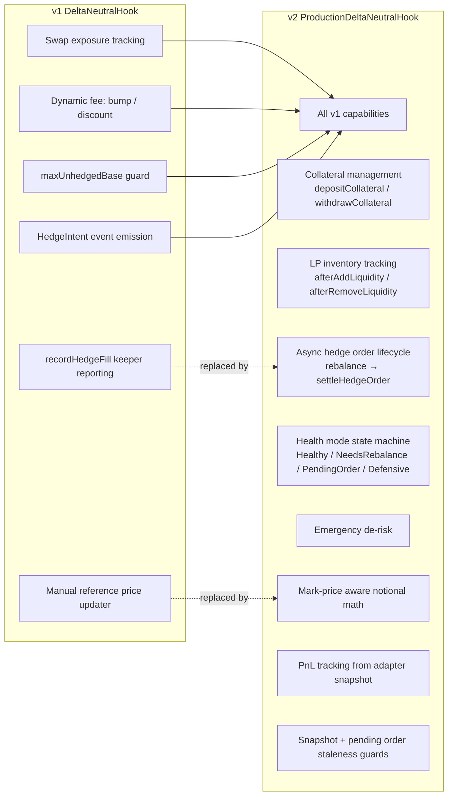
```mermaid
graph LR
    subgraph "v1 DeltaNeutralHook"
        V1A["Swap exposure tracking"]
        V1B["Dynamic fee: bump / discount"]
        V1C["maxUnhedgedBase guard"]
        V1D["HedgeIntent event emission"]
        V1E["recordHedgeFill keeper reporting"]
        V1F["Manual reference price updater"]
    end

    subgraph "v2 ProductionDeltaNeutralHook"
        V2A["All v1 capabilities"]
        V2B["Collateral management\ndepositCollateral / withdrawCollateral"]
        V2C["LP inventory tracking\nafterAddLiquidity / afterRemoveLiquidity"]
        V2D["Async hedge order lifecycle\nrebalance → settleHedgeOrder"]
        V2E["Health mode state machine\nHealthy / NeedsRebalance / PendingOrder / Defensive"]
        V2F["Emergency de-risk"]
        V2G["Mark-price aware notional math"]
        V2H["PnL tracking from adapter snapshot"]
        V2I["Snapshot + pending order staleness guards"]
    end

    V1A --> V2A
    V1B --> V2A
    V1C --> V2A
    V1D --> V2A
    V1E -.->|"replaced by"| V2D
    V1F -.->|"replaced by"| V2G
```

| Capability | v1 `DeltaNeutralHook` | v2 `ProductionDeltaNeutralHook` |
|---|---|---|
| Swap exposure tracking | yes | yes |
| Dynamic fee (inventory bump / discount) | yes | yes |
| Max unhedged exposure guard | yes | yes (renamed `maxResidualDeltaBase`) |
| Hedge intent emission | yes (`HedgeIntent` event) | yes (`RebalanceNeeded` event) |
| Keeper hedge reporting | `recordHedgeFill` | replaced by async order lifecycle |
| Manual reference price | yes (`updateReferencePrice`) | replaced by adapter mark price |
| Collateral management | no | yes |
| LP add/remove inventory tracking | no | yes |
| Async hedge order lifecycle | no | yes |
| Health mode state machine | no | yes (4 active modes + Paused) |
| Emergency de-risk | no | yes |
| LP principal vs fee split tracking | no | yes |
| PnL tracking (realized + unrealized) | no | yes |
| Snapshot staleness guard | no | yes |
| Pending order staleness guard | no | yes |
| Config fields | 10 | 15 |
| Risk state fields | 7 | 19 |
| Active hook permission flags | 3 | 7 |
| Deployed network | Ethereum Sepolia | Base Sepolia |

## DeltaNeutralHook — v1 Capstone

### What The Hook Does

The hook tracks three core quantities for each configured pool:

```
poolBaseExposure + reportedHedgeBase = netBaseDelta
```

- `poolBaseExposure`: base-asset exposure accumulated by swaps through the v4
  pool.
- `reportedHedgeBase`: hedge exposure reported by an authorized keeper calling
  `recordHedgeFill`.
- `netBaseDelta`: remaining unhedged base exposure.
- `pendingHedgeBase`: the hedge delta the hook wants the keeper to fill next.

When swaps move the pool away from neutral, `afterSwap` updates
`poolBaseExposure`. If the absolute net delta crosses `hedgeThresholdBase`, the
hook emits `HedgeIntent` and stores:

```
pendingHedgeBase = −netBaseDelta
```

A long base inventory requests a short hedge. A short base inventory requests a
long hedge.

### Data Model

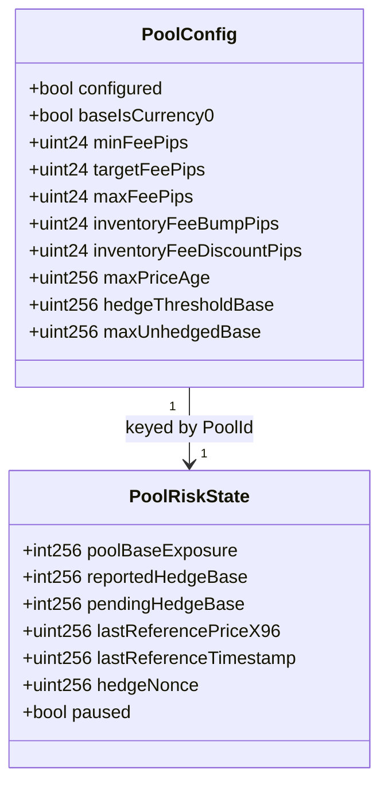
```mermaid
classDiagram
    class PoolConfig {
        +bool configured
        +bool baseIsCurrency0
        +uint24 minFeePips
        +uint24 targetFeePips
        +uint24 maxFeePips
        +uint24 inventoryFeeBumpPips
        +uint24 inventoryFeeDiscountPips
        +uint256 maxPriceAge
        +uint256 hedgeThresholdBase
        +uint256 maxUnhedgedBase
    }

    class PoolRiskState {
        +int256 poolBaseExposure
        +int256 reportedHedgeBase
        +int256 pendingHedgeBase
        +uint256 lastReferencePriceX96
        +uint256 lastReferenceTimestamp
        +uint256 hedgeNonce
        +bool paused
    }

    PoolConfig "1" --> "1" PoolRiskState : keyed by PoolId
```

### Hook Permissions

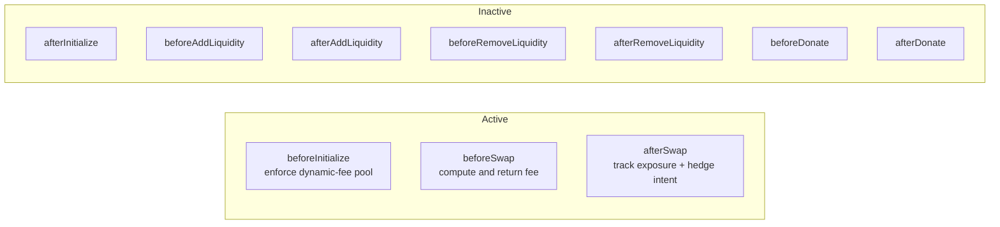
```mermaid
graph LR
    subgraph "Active"
        BI["beforeInitialize\nenforce dynamic-fee pool"]
        BS["beforeSwap\ncompute and return fee"]
        AS["afterSwap\ntrack exposure + hedge intent"]
    end
    subgraph "Inactive"
        AI["afterInitialize"]
        BAL["beforeAddLiquidity"]
        AAL["afterAddLiquidity"]
        BRL["beforeRemoveLiquidity"]
        ARL["afterRemoveLiquidity"]
        BD["beforeDonate"]
        AD["afterDonate"]
    end
```

Liquidity callbacks are intentionally inactive in v1. The hook does not track
who adds or removes liquidity — that is one of the core limitations addressed in
v2.

### Swap Flow

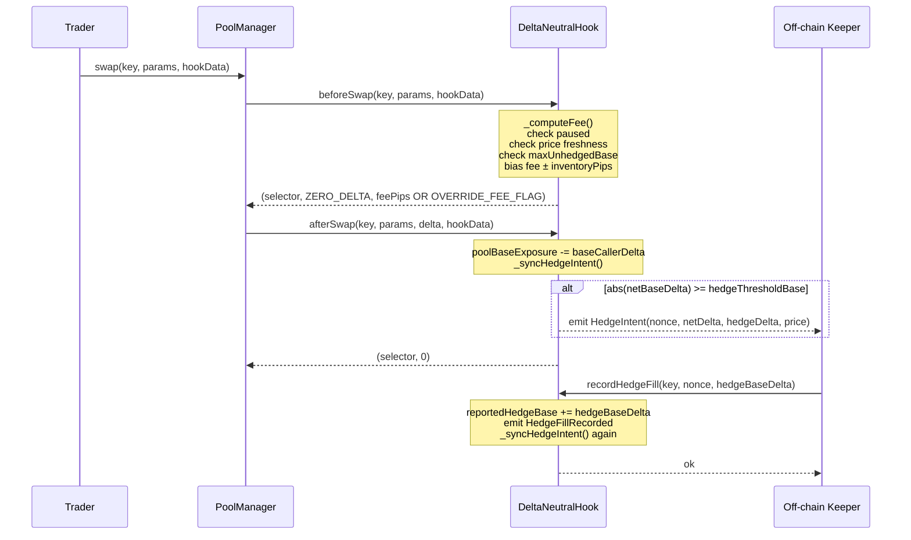
```mermaid
sequenceDiagram
    participant Trader
    participant PoolManager
    participant Hook as DeltaNeutralHook
    participant Keeper as Off-chain Keeper

    Trader->>PoolManager: swap(key, params, hookData)
    PoolManager->>Hook: beforeSwap(key, params, hookData)
    Note over Hook: _computeFee()<br/>check paused<br/>check price freshness<br/>check maxUnhedgedBase<br/>bias fee ± inventoryPips
    Hook-->>PoolManager: (selector, ZERO_DELTA, feePips OR OVERRIDE_FEE_FLAG)

    PoolManager->>Hook: afterSwap(key, params, delta, hookData)
    Note over Hook: poolBaseExposure -= baseCallerDelta<br/>_syncHedgeIntent()

    alt abs(netBaseDelta) >= hedgeThresholdBase
        Hook-->>Keeper: emit HedgeIntent(nonce, netDelta, hedgeDelta, price)
    end
    Hook-->>PoolManager: (selector, 0)

    Keeper->>Hook: recordHedgeFill(key, nonce, hedgeBaseDelta)
    Note over Hook: reportedHedgeBase += hedgeBaseDelta<br/>emit HedgeFillRecorded<br/>_syncHedgeIntent() again
    Hook-->>Keeper: ok
```

### Dynamic Fee Policy

The fee pivots around `targetFeePips` based on whether the incoming swap
increases or decreases the pool's current inventory imbalance.

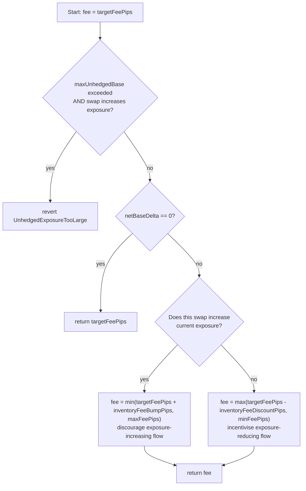
```mermaid
flowchart TD
    A["Start: fee = targetFeePips"] --> G
    G{"maxUnhedgedBase exceeded\nAND swap increases exposure?"}
    G -->|yes| ERR["revert UnhedgedExposureTooLarge"]
    G -->|no| B
    B{"netBaseDelta == 0?"}
    B -->|yes| Z["return targetFeePips"]
    B -->|no| C
    C{"Does this swap increase\ncurrent exposure?"}
    C -->|yes| D["fee = min(targetFeePips + inventoryFeeBumpPips, maxFeePips)\ndiscourage exposure-increasing flow"]
    C -->|no| E["fee = max(targetFeePips - inventoryFeeDiscountPips, minFeePips)\nincentivise exposure-reducing flow"]
    D --> Z2["return fee"]
    E --> Z2
```

### Hedge Intent Lifecycle

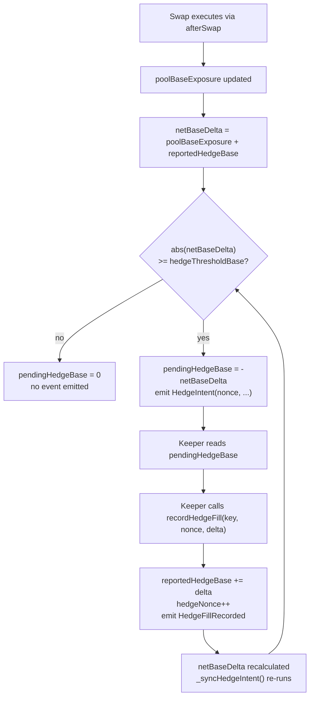
```mermaid
flowchart TD
    S["Swap executes via afterSwap"] --> P["poolBaseExposure updated"]
    P --> N["netBaseDelta = poolBaseExposure + reportedHedgeBase"]
    N --> T{"abs(netBaseDelta)\n>= hedgeThresholdBase?"}
    T -->|no| IDLE["pendingHedgeBase = 0\nno event emitted"]
    T -->|yes| EMIT["pendingHedgeBase = -netBaseDelta\nemit HedgeIntent(nonce, ...)"]
    EMIT --> K["Keeper reads pendingHedgeBase"]
    K --> F["Keeper calls recordHedgeFill(key, nonce, delta)"]
    F --> R["reportedHedgeBase += delta\nhedgeNonce++\nemit HedgeFillRecorded"]
    R --> N2["netBaseDelta recalculated\n_syncHedgeIntent() re-runs"]
    N2 --> T
```

### Entry Points

| Function | Access | Description |
|---|---|---|
| `configurePool(PoolKey, PoolConfigInput)` | owner | Set fee bounds, price age, hedge threshold, max unhedged |
| `setKeeper(address, bool)` | owner | Authorize or revoke keeper wallets |
| `setPriceUpdater(address, bool)` | owner | Authorize or revoke price updater wallets |
| `transferOwnership(address)` | owner | Transfer hook ownership |
| `updateReferencePrice(PoolKey, uint256)` | priceUpdater | Post a reference price in X96 format |
| `recordHedgeFill(PoolKey, uint256 nonce, int256 delta)` | keeper | Report an externally executed hedge fill |
| `setPoolPaused(PoolKey, bool)` | owner | Pause or unpause swap routing |
| `getRiskState(PoolKey)` | view | Read all risk state fields |
| `netBaseDelta(PoolKey)` | view | `poolBaseExposure + reportedHedgeBase` |
| `previewFee(PoolKey, SwapParams)` | view | Simulate the fee for a given swap direction |

## ProductionDeltaNeutralHook — v2 Production

### What The Hook Does

The production hook retains the core accounting and fee model from v1 and extends
it in four areas:

1. **Collateral management.** The hook holds strategy collateral in an ERC20
   token and verifies a minimum collateral ratio and leverage bound before
   permitting any rebalance or exposure-increasing swap.

2. **LP inventory tracking.** `afterAddLiquidity` and `afterRemoveLiquidity`
   split deltas into principal and fee components, updating `poolBaseExposure`
   and `lpBaseDeposited` so the exposure register stays accurate through LP
   events, not just swaps.

3. **Async hedge order lifecycle.** Instead of passively emitting intent, the
   hook drives a two-step flow: `rebalance` calls `hedgeAdapter.commitHedge`, and
   `settleHedgeOrder` calls `hedgeAdapter.settleHedge` once the settlement window
   is reached.

4. **Health mode state machine.** The hook maintains a `HealthMode` enum that
   reflects the current operational state. Keepers observe this field to decide
   next actions, and the hook enforces per-mode constraints on swaps and
   rebalances.

### Health Mode State Machine

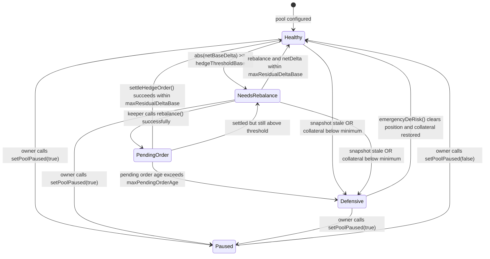
```mermaid
stateDiagram-v2
    [*] --> Healthy : pool configured
    Healthy --> NeedsRebalance : abs(netBaseDelta) >= hedgeThresholdBase
    NeedsRebalance --> Healthy : rebalance and netDelta within maxResidualDeltaBase
    NeedsRebalance --> PendingOrder : keeper calls rebalance() successfully
    PendingOrder --> Healthy : settleHedgeOrder() succeeds within maxResidualDeltaBase
    PendingOrder --> NeedsRebalance : settled but still above threshold
    PendingOrder --> Defensive : pending order age exceeds maxPendingOrderAge
    Healthy --> Defensive : snapshot stale OR collateral below minimum
    NeedsRebalance --> Defensive : snapshot stale OR collateral below minimum
    Defensive --> Healthy : emergencyDeRisk() clears position and collateral restored
    Healthy --> Paused : owner calls setPoolPaused(true)
    NeedsRebalance --> Paused : owner calls setPoolPaused(true)
    Defensive --> Paused : owner calls setPoolPaused(true)
    Paused --> Healthy : owner calls setPoolPaused(false)
```

### Data Model

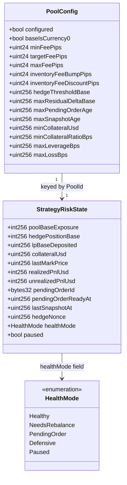
```mermaid
classDiagram
    class PoolConfig {
        +bool configured
        +bool baseIsCurrency0
        +uint24 minFeePips
        +uint24 targetFeePips
        +uint24 maxFeePips
        +uint24 inventoryFeeBumpPips
        +uint24 inventoryFeeDiscountPips
        +uint256 hedgeThresholdBase
        +uint256 maxResidualDeltaBase
        +uint256 maxPendingOrderAge
        +uint256 maxSnapshotAge
        +uint256 minCollateralUsd
        +uint256 minCollateralRatioBps
        +uint256 maxLeverageBps
        +uint256 maxLossBps
    }

    class StrategyRiskState {
        +int256 poolBaseExposure
        +int256 hedgePositionBase
        +uint256 lpBaseDeposited
        +uint256 collateralUsd
        +uint256 lastMarkPrice
        +int256 realizedPnlUsd
        +int256 unrealizedPnlUsd
        +bytes32 pendingOrderId
        +uint256 pendingOrderReadyAt
        +uint256 lastSnapshotAt
        +uint256 hedgeNonce
        +HealthMode healthMode
        +bool paused
    }

    class HealthMode {
        <<enumeration>>
        Healthy
        NeedsRebalance
        PendingOrder
        Defensive
        Paused
    }

    PoolConfig "1" --> "1" StrategyRiskState : keyed by PoolId
    StrategyRiskState --> HealthMode : healthMode field
```

### Hook Permissions

In v2 the liquidity callbacks are active so LP events feed the exposure register.

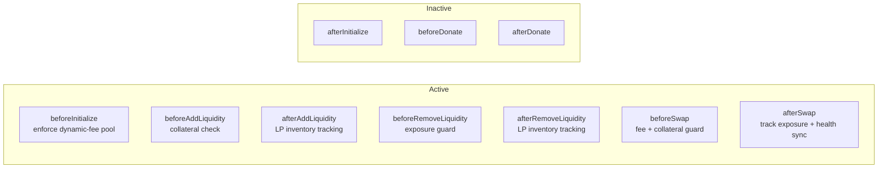
```mermaid
graph LR
    subgraph "Active"
        BI["beforeInitialize\nenforce dynamic-fee pool"]
        BAL["beforeAddLiquidity\ncollateral check"]
        AAL["afterAddLiquidity\nLP inventory tracking"]
        BRL["beforeRemoveLiquidity\nexposure guard"]
        ARL["afterRemoveLiquidity\nLP inventory tracking"]
        BS["beforeSwap\nfee + collateral guard"]
        AS["afterSwap\ntrack exposure + health sync"]
    end
    subgraph "Inactive"
        AI["afterInitialize"]
        BD["beforeDonate"]
        AD["afterDonate"]
    end
```

### Swap and Rebalance Lifecycle

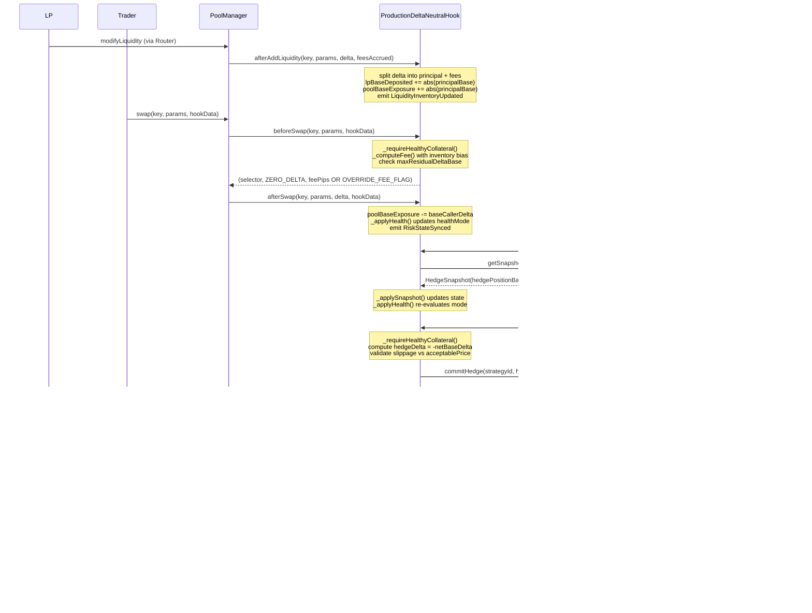
```mermaid
sequenceDiagram
    participant LP
    participant Trader
    participant PoolManager
    participant Hook as ProductionDeltaNeutralHook
    participant Adapter as IHedgeAdapter
    participant Keeper

    LP->>PoolManager: modifyLiquidity (via Router)
    PoolManager->>Hook: afterAddLiquidity(key, params, delta, feesAccrued)
    Note over Hook: split delta into principal + fees<br/>lpBaseDeposited += abs(principalBase)<br/>poolBaseExposure += abs(principalBase)<br/>emit LiquidityInventoryUpdated

    Trader->>PoolManager: swap(key, params, hookData)
    PoolManager->>Hook: beforeSwap(key, params, hookData)
    Note over Hook: _requireHealthyCollateral()<br/>_computeFee() with inventory bias<br/>check maxResidualDeltaBase
    Hook-->>PoolManager: (selector, ZERO_DELTA, feePips OR OVERRIDE_FEE_FLAG)

    PoolManager->>Hook: afterSwap(key, params, delta, hookData)
    Note over Hook: poolBaseExposure -= baseCallerDelta<br/>_applyHealth() updates healthMode<br/>emit RiskStateSynced

    Keeper->>Hook: syncHedgeSnapshot(key)
    Hook->>Adapter: getSnapshot(strategyId)
    Adapter-->>Hook: HedgeSnapshot(hedgePositionBase, collateralUsd, markPrice, pnl, ...)
    Note over Hook: _applySnapshot() updates state<br/>_applyHealth() re-evaluates mode

    Keeper->>Hook: rebalance(key, acceptablePrice)
    Note over Hook: _requireHealthyCollateral()<br/>compute hedgeDelta = -netBaseDelta<br/>validate slippage vs acceptablePrice
    Hook->>Adapter: commitHedge(strategyId, hedgeDelta, acceptablePrice)
    Adapter-->>Hook: orderId
    Note over Hook: pendingOrderId = orderId<br/>pendingOrderReadyAt = now + settlementDelay<br/>healthMode = PendingOrder<br/>emit HedgeOrderCommitted

    Note over Keeper: wait until block.timestamp >= pendingOrderReadyAt

    Keeper->>Hook: settleHedgeOrder(key)
    Hook->>Adapter: settleHedge(strategyId, orderId)
    Adapter-->>Hook: ok
    Hook->>Adapter: getSnapshot(strategyId)
    Adapter-->>Hook: updated HedgeSnapshot
    Note over Hook: _applySnapshot() + _applyHealth()<br/>healthMode transitions to Healthy or NeedsRebalance<br/>emit HedgeOrderSettled
```

### Collateral Safety Check

Every rebalance and exposure-increasing operation passes through this gate before
touching the adapter.

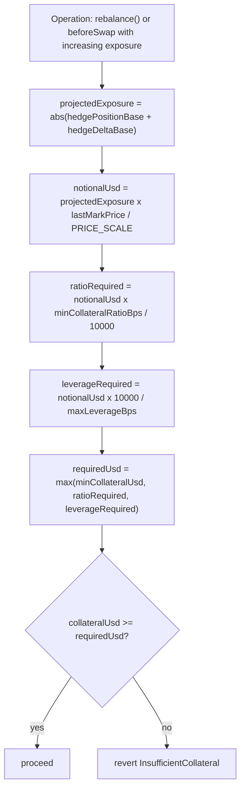
```mermaid
flowchart TD
    A["Operation: rebalance() or beforeSwap with increasing exposure"] --> B
    B["projectedExposure = abs(hedgePositionBase + hedgeDeltaBase)"]
    B --> C["notionalUsd = projectedExposure x lastMarkPrice / PRICE_SCALE"]
    C --> D["ratioRequired = notionalUsd x minCollateralRatioBps / 10000"]
    D --> E["leverageRequired = notionalUsd x 10000 / maxLeverageBps"]
    E --> F["requiredUsd = max(minCollateralUsd, ratioRequired, leverageRequired)"]
    F --> G{"collateralUsd >= requiredUsd?"}
    G -->|yes| H["proceed"]
    G -->|no| I["revert InsufficientCollateral"]
```

### LP Inventory Tracking

`afterAddLiquidity` and `afterRemoveLiquidity` decompose the v4 delta into
principal and fee components so the exposure register stays accurate through
liquidity events, not just swaps.

```solidity
int256 feeBaseDelta   = _baseAmount(config, feesAccrued);
int256 principalBase  = _baseAmount(config, delta) - feeBaseDelta;

// adding liquidity
state.lpBaseDeposited  += _abs(principalBase);
state.poolBaseExposure += int256(_abs(principalBase));

// removing liquidity
state.lpBaseDeposited  -= _abs(principalBase);
state.poolBaseExposure -= int256(_abs(principalBase));
```

### Entry Points

| Function | Access | Description |
|---|---|---|
| `configurePool(PoolKey, PoolConfigInput)` | owner | Full pool setup: fees, thresholds, collateral limits |
| `setKeeper(address, bool)` | owner | Authorize or revoke keeper wallets |
| `setLiquidityManager(address, bool)` | owner | Authorize or revoke LP manager wallets |
| `setStrategyManager(address)` | owner | Set strategy manager address |
| `transferOwnership(address)` | owner | Transfer hook ownership |
| `depositCollateral(PoolKey, uint256)` | strategyManager | Transfer collateral ERC20 into hook, forwarded to adapter |
| `withdrawCollateral(PoolKey, address, uint256)` | strategyManager | Withdraw collateral from adapter to recipient |
| `rebalance(PoolKey, uint256 acceptablePrice)` | keeper | Commit a hedge order via adapter |
| `settleHedgeOrder(PoolKey)` | keeper | Settle a pending hedge order via adapter |
| `syncHedgeSnapshot(PoolKey)` | keeper | Pull latest snapshot from adapter into risk state |
| `emergencyDeRisk(PoolKey, uint256 acceptablePrice)` | keeper | Close all hedge positions and reset state |
| `setPoolPaused(PoolKey, bool)` | owner | Pause or unpause the pool |
| `getRiskState(PoolKey)` | view | Read full `StrategyRiskState` |
| `getPoolConfig(PoolKey)` | view | Read `PoolConfig` |
| `netBaseDelta(PoolKey)` | view | `poolBaseExposure + hedgePositionBase` |
| `previewFee(PoolKey, SwapParams)` | view | Simulate the fee for a given swap direction |

## Adapter Layer

### IHedgeAdapter Interface

The adapter interface is the only contract boundary the production hook uses to
communicate with an external hedge venue. All venue-specific complexity lives
behind it, allowing the hook to remain deterministic and venue-agnostic.

| Method | Returns | Description |
|---|---|---|
| `depositCollateral(strategyId, token, amount)` | `collateralUsd` | Move collateral into the venue for this strategy |
| `withdrawCollateral(strategyId, token, recipient, amount)` | `collateralUsd` | Withdraw collateral from the venue |
| `commitHedge(strategyId, hedgeDelta, acceptablePrice)` | `orderId` | Open or adjust a hedge position asynchronously |
| `settleHedge(strategyId, orderId)` | — | Finalize a pending hedge order |
| `getSnapshot(strategyId)` | `HedgeSnapshot` | Pull current position, collateral, mark price, and PnL |

`HedgeSnapshot` carries: `hedgePositionBase`, `collateralUsd`, `markPrice`,
`realizedPnlUsd`, `unrealizedPnlUsd`, and `pendingOrderReadyAt`.

### SynthetixV3HedgeAdapter

`SynthetixV3HedgeAdapter` targets the Synthetix V3 Perps proxy and is wired at
deploy time to a specific `accountId`, `marketId`, and `synthMarketId`. It calls:

- `modifyCollateral(accountId, synthMarketId, amountDelta)` to move assets in or
  out of the Synthetix margin account.
- `commitOrder(accountId, marketId, sizeDelta, settlementStrategyId, acceptablePrice)`
  to queue a perp order.
- `settleOrder(accountId)` to finalize an order once the settlement window is
  reached.

The async settlement sequence matches the hook's two-step rebalance flow exactly:

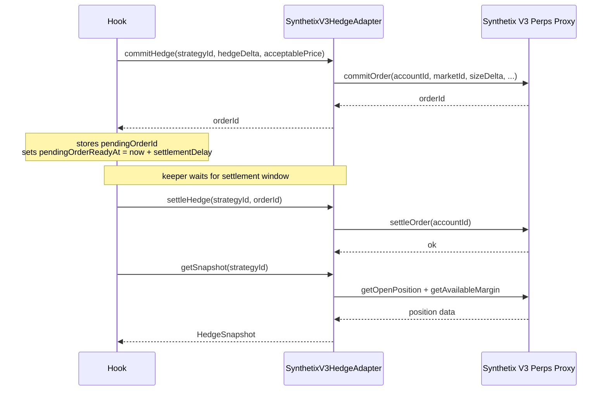
```mermaid
sequenceDiagram
    participant Hook
    participant Adapter as SynthetixV3HedgeAdapter
    participant Synthetix as Synthetix V3 Perps Proxy

    Hook->>Adapter: commitHedge(strategyId, hedgeDelta, acceptablePrice)
    Adapter->>Synthetix: commitOrder(accountId, marketId, sizeDelta, ...)
    Synthetix-->>Adapter: orderId
    Adapter-->>Hook: orderId

    Note over Hook: stores pendingOrderId<br/>sets pendingOrderReadyAt = now + settlementDelay
    Note over Hook,Adapter: keeper waits for settlement window

    Hook->>Adapter: settleHedge(strategyId, orderId)
    Adapter->>Synthetix: settleOrder(accountId)
    Synthetix-->>Adapter: ok

    Hook->>Adapter: getSnapshot(strategyId)
    Adapter->>Synthetix: getOpenPosition + getAvailableMargin
    Synthetix-->>Adapter: position data
    Adapter-->>Hook: HedgeSnapshot
```

### DemoHedgeAdapter

`DemoHedgeAdapter` is used in the Base Sepolia deployment and in the live arena.
It has the same `IHedgeAdapter` interface but its state is directly writable by
authorized callers. This makes it possible to inject mark-price movements, PnL
shocks, and collateral changes without a real perp venue, which is what the live
arena uses to drive the defensive mode showcase scenario.

## Liquidity Router

`ProductionStrategyLiquidityRouter` is a restricted wrapper around the v4
`PoolManager` unlock/callback pattern. Only addresses granted the `operator` role
by the owner can call `modifyLiquidity`, preventing arbitrary wallets from
altering strategy inventory directly.

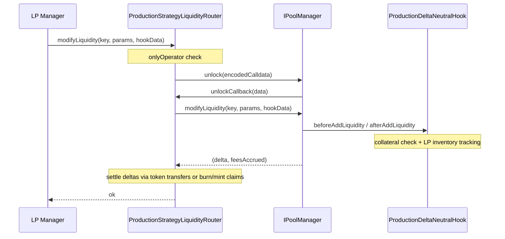
```mermaid
sequenceDiagram
    participant Operator as LP Manager
    participant Router as ProductionStrategyLiquidityRouter
    participant PM as IPoolManager
    participant Hook as ProductionDeltaNeutralHook

    Operator->>Router: modifyLiquidity(key, params, hookData)
    Note over Router: onlyOperator check
    Router->>PM: unlock(encodedCalldata)
    PM->>Router: unlockCallback(data)
    Router->>PM: modifyLiquidity(key, params, hookData)
    PM->>Hook: beforeAddLiquidity / afterAddLiquidity
    Note over Hook: collateral check + LP inventory tracking
    PM-->>Router: (delta, feesAccrued)
    Note over Router: settle deltas via token transfers or burn/mint claims
    Router-->>Operator: ok
```

## The Keeper

The keeper is a TypeScript process using viem that bridges the on-chain hooks and
the external hedge layer. It runs in one of two modes controlled by the
`HOOK_MODE` environment variable.

### Capstone Mode (`HOOK_MODE=capstone`)

In capstone mode the keeper watches `pendingHedgeBase` on `DeltaNeutralHook` and
calls `recordHedgeFill` to simulate hedge completion. This closes the accounting
loop without touching any external venue.

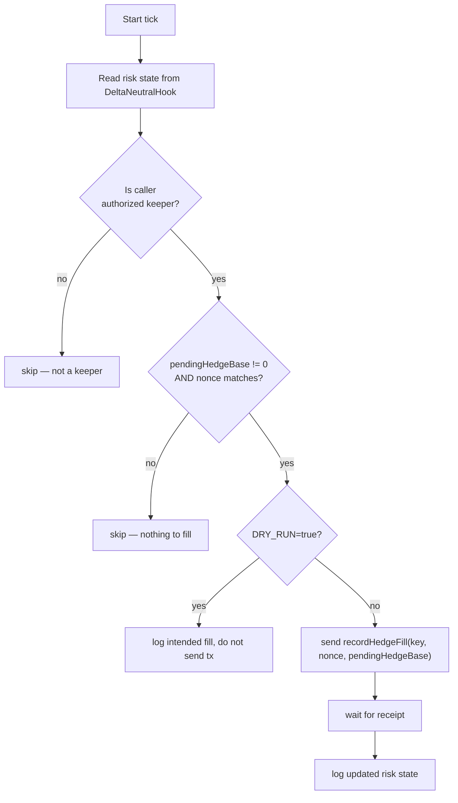
```mermaid
flowchart TD
    A["Start tick"] --> B["Read risk state from DeltaNeutralHook"]
    B --> C{"Is caller\nauthorized keeper?"}
    C -->|no| SKIP["skip — not a keeper"]
    C -->|yes| D
    D{"pendingHedgeBase != 0\nAND nonce matches?"}
    D -->|no| SKIP2["skip — nothing to fill"]
    D -->|yes| E
    E{"DRY_RUN=true?"}
    E -->|yes| LOG["log intended fill, do not send tx"]
    E -->|no| F["send recordHedgeFill(key, nonce, pendingHedgeBase)"]
    F --> G["wait for receipt"]
    G --> H["log updated risk state"]
```

### Production Mode (`HOOK_MODE=production`)

In production mode the keeper drives the full async rebalance cycle against
`ProductionDeltaNeutralHook`.

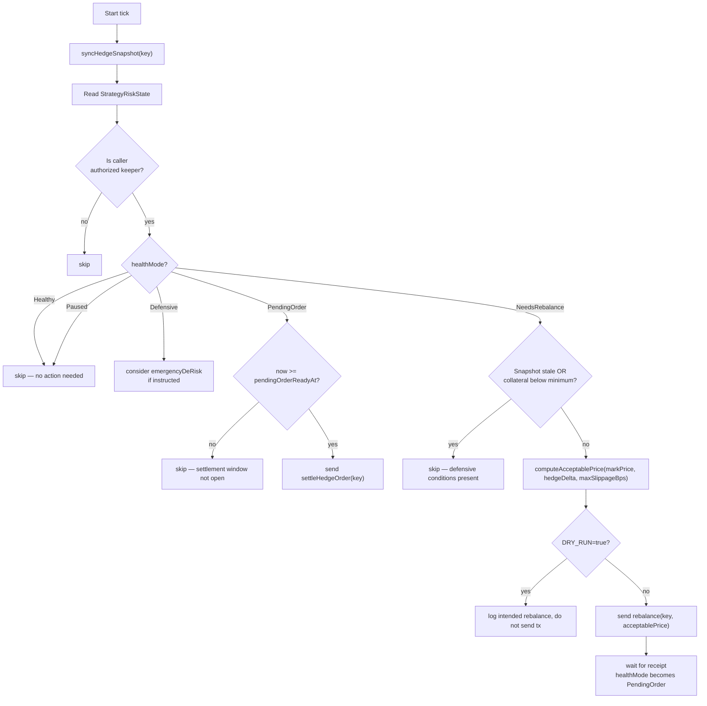
```mermaid
flowchart TD
    A["Start tick"] --> B["syncHedgeSnapshot(key)"]
    B --> C["Read StrategyRiskState"]
    C --> D{"Is caller\nauthorized keeper?"}
    D -->|no| SKIP["skip"]
    D -->|yes| E
    E{"healthMode?"}
    E -->|Healthy| IDLE["skip — no action needed"]
    E -->|Paused| IDLE
    E -->|Defensive| DERISK["consider emergencyDeRisk\nif instructed"]
    E -->|PendingOrder| F
    E -->|NeedsRebalance| G
    F{"now >= pendingOrderReadyAt?"}
    F -->|no| WAIT["skip — settlement window not open"]
    F -->|yes| SETTLE["send settleHedgeOrder(key)"]
    G{"Snapshot stale OR\ncollateral below minimum?"}
    G -->|yes| DEFSKIP["skip — defensive conditions present"]
    G -->|no| H["computeAcceptablePrice(markPrice, hedgeDelta, maxSlippageBps)"]
    H --> I{"DRY_RUN=true?"}
    I -->|yes| DRYLOG["log intended rebalance, do not send tx"]
    I -->|no| SEND["send rebalance(key, acceptablePrice)"]
    SEND --> J["wait for receipt\nhealthMode becomes PendingOrder"]
```

### Async Order State Machine

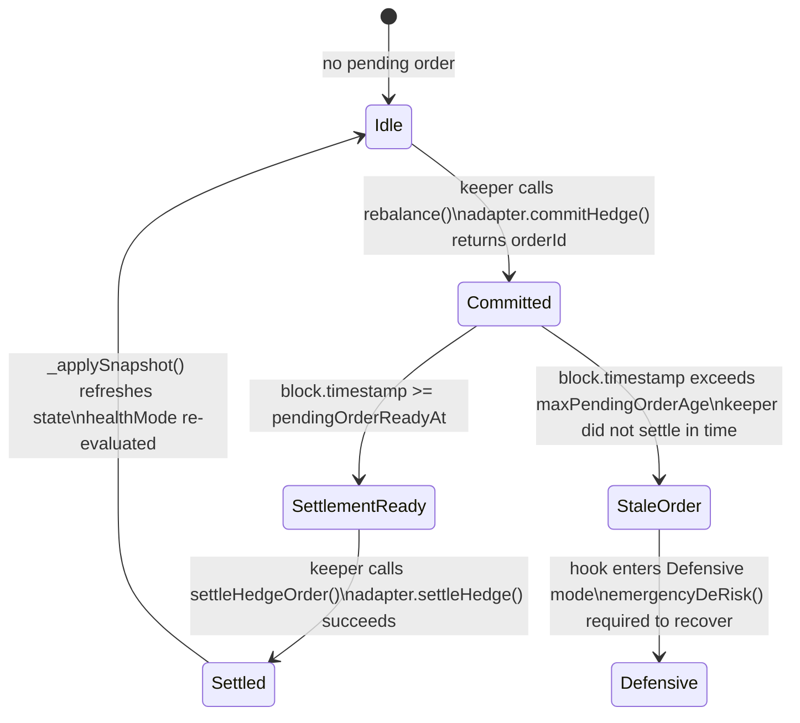
```mermaid
stateDiagram-v2
    [*] --> Idle : no pending order
    Idle --> Committed : keeper calls rebalance()\nadapter.commitHedge() returns orderId
    Committed --> SettlementReady : block.timestamp >= pendingOrderReadyAt
    SettlementReady --> Settled : keeper calls settleHedgeOrder()\nadapter.settleHedge() succeeds
    Settled --> Idle : _applySnapshot() refreshes state\nhealthMode re-evaluated
    Committed --> StaleOrder : block.timestamp exceeds maxPendingOrderAge\nkeeper did not settle in time
    StaleOrder --> Defensive : hook enters Defensive mode\nemergencyDeRisk() required to recover
```

### Environment Variables

| Variable | Required | Default | Description |
|---|---|---|---|
| `RPC_URL` | yes | — | Chain RPC endpoint |
| `PRIVATE_KEY` | yes | — | Keeper wallet private key |
| `HOOK_MODE` | yes | `capstone` | `capstone` or `production` |
| `KEEPER_PRIVATE_KEY` | no | falls back to `PRIVATE_KEY` | Dedicated keeper wallet |
| `POLL_INTERVAL_MS` | no | `10000` | Polling interval in milliseconds |
| `DRY_RUN` | no | `false` | Log decisions without sending transactions |
| `MAX_HEDGE_SLIPPAGE_BPS` | no | `50` | Max acceptable slippage in basis points |

The authorized keeper wallet must be whitelisted by the hook owner via
`setKeeper(address, true)` before it can submit transactions.

### Commands

```bash
cd keeper
npm install
```

**Capstone keeper (Sepolia):**

```bash
# Run one tick
npm run once

# Poll continuously
npm run dev

# Dry-run — inspect the decision without sending a transaction
DRY_RUN=true npm run once
```

On PowerShell:

```powershell
$env:DRY_RUN='true'; npm run once
```

**Production keeper (Base Sepolia):**

```bash
# Run one production tick
HOOK_MODE=production npm run once

# Poll production continuously
HOOK_MODE=production npm run dev

# Dry-run the production decision
HOOK_MODE=production DRY_RUN=true npm run once
```

On PowerShell:

```powershell
$env:HOOK_MODE='production'; $env:DRY_RUN='true'; npm run once
```

**Demo scenarios (production only):**

```bash
# Trigger happy-path rebalance sequence
npm run demo:production:happy

# Drive the hook into defensive mode
npm run demo:production:defensive

# Full scenario: rebalance → defensive → recovery
npm run demo:production:full

# Recover a stale snapshot from on-chain events
npm run production:recover-snapshot
```

**Type-checking:**

```bash
npm run typecheck
```

## Frontends

### Operator Dashboard — `frontend/`

The operator dashboard is a Next.js application using RainbowKit and wagmi. It
is self-contained under `frontend/` and can be deployed as its own Vercel
project.

The dashboard auto-detects the connected chain and switches between capstone mode
(Ethereum Sepolia) and production mode (Base Sepolia), showing the appropriate
controls and contract reads for each.

**Capstone mode panels:**

| Panel | Actions |
|---|---|
| Wallet | Connect wallet, view ETH and token balances |
| Tokens | Faucet dWETH and dUSDC, approve allowances |
| Swap | Execute a swap through `PoolSwapTest`, set direction and amount |
| Risk State | Live reads: `poolBaseExposure`, `reportedHedgeBase`, `pendingHedgeBase`, `netBaseDelta` |
| Fee Preview | `previewFee` for both swap directions |
| Price | `updateReferencePrice` (price updater role) |
| Keeper | `recordHedgeFill` (keeper role) |
| Admin | `setPoolPaused` (owner role) |

**Production mode panels:**

| Panel | Actions |
|---|---|
| Wallet | Connect wallet, view ETH and token balances |
| Tokens | Faucet pdWETH and pdUSDC, approve collateral token |
| Swap | Execute a swap, set direction and amount |
| Liquidity | `modifyStrategyLiquidity` — add or remove LP through the restricted router |
| Risk State | All 19 `StrategyRiskState` fields: `healthMode`, `collateralUsd`, `lastMarkPrice`, `hedgePositionBase`, `realizedPnlUsd`, `unrealizedPnlUsd` |
| Fee Preview | `previewFee` for both directions |
| Keeper | `syncHedgeSnapshot`, `rebalance`, `settleHedgeOrder` (keeper role) |
| Collateral | `depositCollateral`, `withdrawCollateral` (strategy manager role) |
| Adapter | Demo adapter state injection: mark price, PnL shocks, collateral override |
| Admin | `setPoolPaused`, `emergencyDeRisk` (owner role) |

**Running the operator dashboard:**

```bash
cd frontend
cp .env.example .env.local
# Set NEXT_PUBLIC_WALLETCONNECT_PROJECT_ID and NEXT_PUBLIC_SEPOLIA_RPC_URL
npm install
npm run dev
# Opens at http://localhost:3000
```

| Variable | Required | Description |
|---|---|---|
| `NEXT_PUBLIC_WALLETCONNECT_PROJECT_ID` | yes | WalletConnect project ID from cloud.walletconnect.com |
| `NEXT_PUBLIC_SEPOLIA_RPC_URL` | recommended | Public or private Sepolia RPC for contract reads |
| `NEXT_PUBLIC_BASE_SEPOLIA_RPC_URL` | recommended | Public or private Base Sepolia RPC for contract reads |

For Vercel: set the project root to `frontend/` and add the same public
environment variables in the Vercel project settings.

```bash
npm run build     # production build
npm run start     # serve production build locally
npm run typecheck # TypeScript check
```

### Live Arena — `live-demo/`

The live arena is a local-only tool for end-to-end showcase demos. It consists
of an Express API server and a Vite + React dashboard. Together they orchestrate
a fleet of trader wallets executing swaps, a keeper loop, and scripted stress
scenarios against the Base Sepolia production hook.

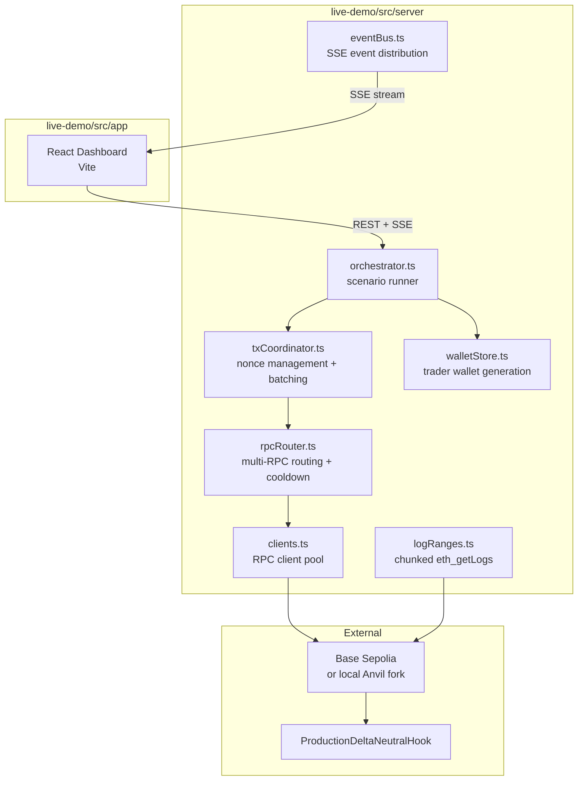
```mermaid
graph TD
    subgraph "live-demo/src/server"
        Orch["orchestrator.ts\nscenario runner"]
        TxCoord["txCoordinator.ts\nnonce management + batching"]
        WalletStore["walletStore.ts\ntrader wallet generation"]
        RpcRouter["rpcRouter.ts\nmulti-RPC routing + cooldown"]
        EventBus["eventBus.ts\nSSE event distribution"]
        Clients["clients.ts\nRPC client pool"]
        LogRanges["logRanges.ts\nchunked eth_getLogs"]
    end

    subgraph "live-demo/src/app"
        UI["React Dashboard\nVite"]
    end

    subgraph "External"
        Chain["Base Sepolia\nor local Anvil fork"]
        Hook2["ProductionDeltaNeutralHook"]
    end

    UI -->|"REST + SSE"| Orch
    Orch --> TxCoord
    Orch --> WalletStore
    TxCoord --> RpcRouter
    RpcRouter --> Clients
    Clients --> Chain
    Chain --> Hook2
    EventBus -->|"SSE stream"| UI
    LogRanges --> Chain
```

**Fork showcase flow:**

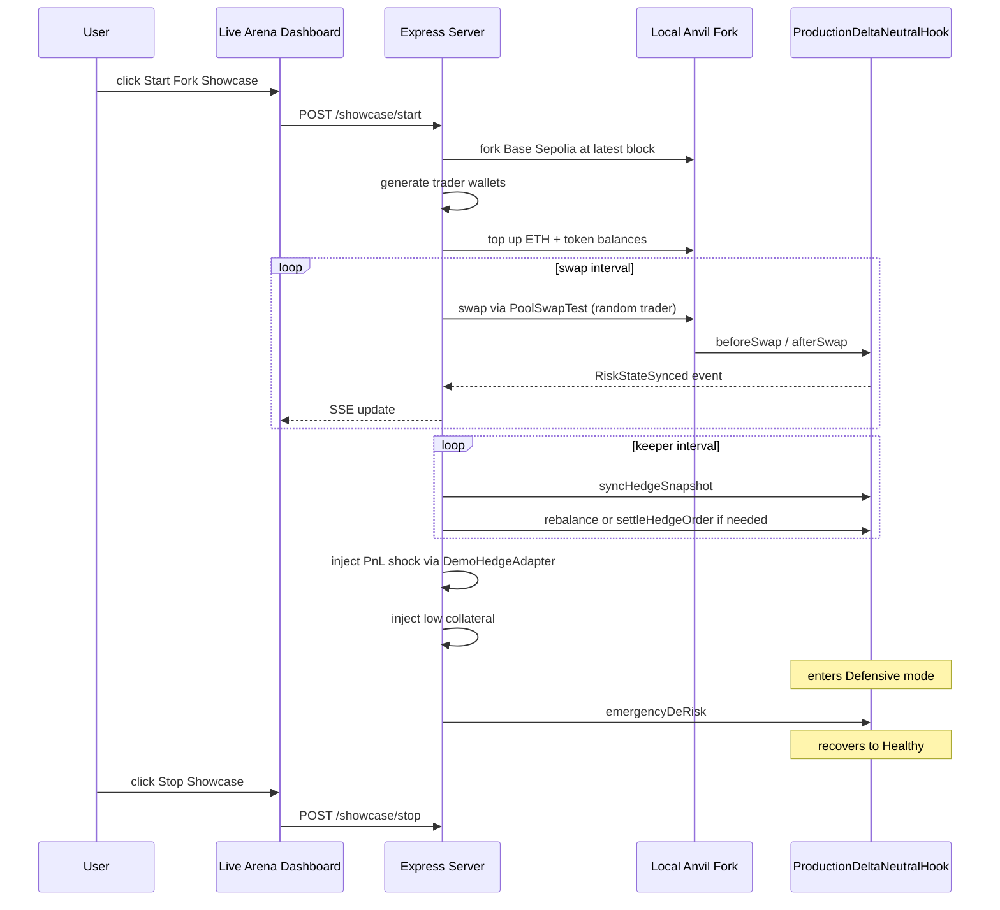
```mermaid
sequenceDiagram
    participant User
    participant Dashboard as Live Arena Dashboard
    participant Server as Express Server
    participant Anvil as Local Anvil Fork
    participant Hook2 as ProductionDeltaNeutralHook

    User->>Dashboard: click Start Fork Showcase
    Dashboard->>Server: POST /showcase/start
    Server->>Anvil: fork Base Sepolia at latest block
    Server->>Server: generate trader wallets
    Server->>Anvil: top up ETH + token balances

    loop swap interval
        Server->>Anvil: swap via PoolSwapTest (random trader)
        Anvil->>Hook2: beforeSwap / afterSwap
        Hook2-->>Server: RiskStateSynced event
        Server-->>Dashboard: SSE update
    end

    loop keeper interval
        Server->>Hook2: syncHedgeSnapshot
        Server->>Hook2: rebalance or settleHedgeOrder if needed
    end

    Server->>Server: inject PnL shock via DemoHedgeAdapter
    Server->>Server: inject low collateral
    Note over Hook2: enters Defensive mode

    Server->>Hook2: emergencyDeRisk
    Note over Hook2: recovers to Healthy

    User->>Dashboard: click Stop Showcase
    Dashboard->>Server: POST /showcase/stop
```

**Live configuration knobs:**

| Variable | Default | Description |
|---|---|---|
| `LIVE_TRADER_COUNT` | `10` | Number of trader wallets to generate |
| `LIVE_TRADER_FUNDING_ETH` | `0.05` | ETH per trader wallet |
| `LIVE_SWAP_INTERVAL_MS` | `4000` | Interval between swap transactions |
| `LIVE_KEEPER_INTERVAL_MS` | `8000` | Interval between keeper ticks |
| `LIVE_MAX_TX_PER_MIN` | `30` | Global transaction rate limit |
| `LIVE_MAX_RUNTIME_MINUTES` | `20` | Auto-stop showcase after this duration |
| `LIVE_REPLACEMENT_FEE_BUMP_BPS` | `2500` | Fee bump for stuck tx replacement |
| `LIVE_NONCE_CONFIRM_TIMEOUT_MS` | `120000` | Timeout before treating a nonce as stuck |
| `LIVE_ALLOW_WALLET_ROTATION` | `false` | Rotate stuck wallets instead of pausing them |
| `LIVE_RPC_COOLDOWN_MS` | `30000` | Rate-limit cooldown per RPC endpoint |
| `LIVE_RPC_RETRY_ATTEMPTS` | `2` | Retries on RPC failure before cooldown |
| `LIVE_TRADER_BALANCE_REFRESH_MS` | `15000` | Cache duration for trader balance reads |
| `LIVE_GET_LOGS_BLOCK_SPAN` | `10` | Block range per `eth_getLogs` chunk (Alchemy free-tier compatible) |
| `LIVE_PRICE_BACKFILL_BLOCKS` | `40` | Blocks to backfill for the price chart |
| `LIVE_MODE` | `base-sepolia` | `base-sepolia` or `fork` |
| `LIVE_FORK_RPC_URL` | `http://127.0.0.1:8545` | Anvil fork endpoint |
| `LIVE_FORK_TRADER_COUNT` | `5` | Trader wallets in fork mode |
| `LIVE_FORK_TRADER_FUNDING_ETH` | `0.02` | ETH per trader in fork mode |
| `LIVE_FORK_BACKOFF_MS` | `3000` | Back-off between fork retries |
| `LIVE_FORK_MAX_CONSECUTIVE_ERRORS` | `5` | Error limit before stopping fork loop |
| `LIVE_SHOWCASE_EXPOSURE_TARGET_BASE` | `1` | Swap volume target during showcase |
| `LIVE_SHOWCASE_NET_DELTA_TARGET_BASE` | `0.1` | Delta threshold to trigger showcase rebalance |
| `LIVE_SHOWCASE_MARK_PRICE_START` | `2000` | Starting mark price for showcase |
| `LIVE_SHOWCASE_MARK_PRICE_STEP` | `100` | Mark price increment per showcase phase |
| `LIVE_SHOWCASE_REALIZED_LOSS_USD` | `5000` | Injected realized loss for defensive showcase |
| `LIVE_SHOWCASE_UNREALIZED_LOSS_USD` | `2500` | Injected unrealized loss for defensive showcase |
| `LIVE_SHOWCASE_LOW_COLLATERAL_USD` | `500` | Injected low collateral for defensive showcase |
| `LIVE_SHOWCASE_PHASE_DELAY_MS` | `5000` | Pause between showcase phases |

**Recommended Base Sepolia RPC endpoints:**

| Role | Options |
|---|---|
| `BASE_SEPOLIA_RPC_URL` (reads) | `https://sepolia.base.org`, `https://base-sepolia-rpc.publicnode.com`, Coinbase CDP Node |
| `BASE_SEPOLIA_WRITE_RPC_URL` (deployer / keeper writes) | Coinbase CDP Node, QuickNode, or `https://sepolia.base.org` |
| `BASE_SEPOLIA_WRITE_RPC_URLS` (trader write pool) | `https://base-sepolia.gateway.tenderly.co`, `https://base-sepolia.rpc.sentio.xyz`, `https://base-sepolia.api.onfinality.io/public`, `https://base-sepolia-public.nodies.app` |

## Deployments

### Ethereum Sepolia — Capstone

The Sepolia deployment uses official Uniswap v4 test infrastructure and mock ERC20
assets.

| Contract | Address |
|---|---|
| PoolManager | `0xE03A1074c86CFeDd5C142C4F04F1a1536e203543` |
| PoolSwapTest | `0x9B6b46e2c869aa39918Db7f52f5557FE577B6eEe` |
| PoolModifyLiquidityTest | `0x0C478023803a644c94c4CE1C1e7b9A087e411B0A` |
| DeltaNeutralHook | `0x7973Cc2DCC1d6003eD8ed9374e5AA7cF5deeA0c0` |
| dWETH (base token) | `0xc228690aD6a65182C8CFbDC422c92039C8975ABe` |
| dUSDC (quote token) | `0xF952fCC11cd07528D2093852ed37b5868cc2A469` |

| Parameter | Value |
|---|---|
| Pool ID | `0x06ab8729fca805161a8bf832999b9342ca9c0d835a942817ebde97282d3e9908` |
| Tick Spacing | 60 |
| Fee | DYNAMIC_FEE_FLAG |
| baseIsCurrency0 | true |
| minFeePips | 100 (0.01 %) |
| targetFeePips | 500 (0.05 %) |
| maxFeePips | 3000 (0.30 %) |
| inventoryFeeBumpPips | 700 |
| inventoryFeeDiscountPips | 200 |
| hedgeThresholdBase | 0.01 ETH |
| maxUnhedgedBase | 100 ETH |
| maxPriceAge | 86400 s (24 h) |

Deployment artifacts: `deployments/sepolia.json` and
`frontend/src/generated/sepolia.json`.

### Base Sepolia — Production

The Base Sepolia deployment uses the official Base Sepolia Uniswap v4 PoolManager
and a `DemoHedgeAdapter` in place of the live Synthetix V3 adapter.

| Contract | Address |
|---|---|
| PoolManager | `0x05E73354cFDd6745C338b50BcFDfA3Aa6fA03408` |
| PoolSwapTest | `0x1000ce4BD3fdb281851f76aB76D79eCe2782c3D1` |
| ProductionStrategyLiquidityRouter | `0x89086E8e5AE2fF9260F3ef469f31aFc1E36D0191` |
| ProductionDeltaNeutralHook | `0x9A1537f3d958fe6062A1a812E83d5501c1E26FC0` |
| DemoHedgeAdapter | `0xdd545adDce7fbC82C02483BF6c8cAdc6AD70c85A` |
| pdWETH (base token) | `0x5ca56ffcaA5F4Cb7cc1141106B35Be9532620Dd1` |
| pdUSDC (quote token) | `0x342C3Eb307306C22b226A32985E344B603eb5E37` |
| Collateral Token | `0xd5eee4FB7F65175F3F6Fa2Da3Ca775ac43C196c1` |

| Parameter | Value |
|---|---|
| Pool ID | `0x0e058e2fd5b370a3bcbaf5f81b97e7ff3d5bd5f72c45eef5bff6d65b3707541a` |
| Tick Spacing | 60 |
| Fee | DYNAMIC_FEE_FLAG |
| baseIsCurrency0 | false |
| minFeePips | 100 (0.01 %) |
| targetFeePips | 500 (0.05 %) |
| maxFeePips | 3000 (0.30 %) |
| inventoryFeeBumpPips | 700 |
| inventoryFeeDiscountPips | 200 |
| hedgeThresholdBase | 0.01 ETH (10000000000000000 wei) |
| maxResidualDeltaBase | 0.005 ETH |
| maxPendingOrderAge | 3600 s (1 h) |
| maxSnapshotAge | 300 s (5 min) |
| minCollateralUsd | 1,000 USD |
| minCollateralRatioBps | 5000 (50 %) |
| maxLeverageBps | 300000 (30x) |
| maxLossBps | 2000 (20 %) |
| Initial Collateral | 100,000 collateral tokens |
| Initial Liquidity | 1,000 ETH equivalent |

Deployment artifacts: `deployments/base-sepolia-production.json` and
`frontend/src/generated/base-sepolia-production.json`.

## Running The Contracts

```bash
cp .env.example .env
# Fill PRIVATE_KEY, SEPOLIA_RPC_URL, BASE_SEPOLIA_RPC_URL,
# and optionally ETHERSCAN_API_KEY / BASESCAN_API_KEY

forge test
```

**Deploy to Ethereum Sepolia (capstone):**

```bash
forge script script/DeploySepolia.s.sol:DeploySepolia \
  --rpc-url $SEPOLIA_RPC_URL \
  --broadcast \
  --verify
```

**Deploy to Base Sepolia (production):**

```bash
forge script script/DeployProductionBaseSepolia.s.sol:DeployProductionBaseSepolia \
  --rpc-url $BASE_SEPOLIA_RPC_URL \
  --broadcast \
  --verify
```

Each deploy script:

1. Mines a hook address satisfying the required v4 permission flags using
   `HookAddressMiner`.
2. Deploys mock ERC20 tokens (`DemoERC20`).
3. Deploys the hook via CREATE2 at the mined address.
4. Production only: deploys `DemoHedgeAdapter` and
   `ProductionStrategyLiquidityRouter`.
5. Initializes a dynamic-fee v4 pool at `SQRT_PRICE_1_1`.
6. Configures all risk and fee parameters.
7. Production only: deposits initial collateral and sets up token approvals.
8. Seeds initial liquidity.
9. Writes deployment JSON to `deployments/` and `frontend/src/generated/`.

## Running The Keeper

```bash
cd keeper
cp .env.example .env
# Fill RPC_URL (Sepolia for capstone, Base Sepolia for production)
# Fill PRIVATE_KEY (must be whitelisted keeper on the hook)
# Set HOOK_MODE=capstone or HOOK_MODE=production
npm install
```

**One-shot tick:**

```bash
npm run once
```

**Continuous polling:**

```bash
npm run dev
```

**Dry-run (decisions logged, no transactions sent):**

```bash
DRY_RUN=true npm run once
```

On PowerShell:

```powershell
$env:DRY_RUN='true'; npm run once
```

**Production keeper shorthand:**

```bash
HOOK_MODE=production npm run dev
```

**Type-checking:**

```bash
npm run typecheck
```

Use `KEEPER_PRIVATE_KEY` to separate the keeper wallet from `PRIVATE_KEY`. The
wallet must be authorized by `keepers(address)` on the hook before it can submit
transactions.

## Running The Frontends

### Operator Dashboard

```bash
cd frontend
cp .env.example .env.local
# Set NEXT_PUBLIC_WALLETCONNECT_PROJECT_ID and NEXT_PUBLIC_SEPOLIA_RPC_URL
npm install
npm run dev
# Opens at http://localhost:3000
```

```bash
npm run build     # production build
npm run start     # serve production build locally
npm run typecheck # TypeScript check
```

For Vercel: set the project root to `frontend/` and configure the same public
environment variables in the Vercel project settings.

### Live Arena

```bash
cd live-demo
cp .env.example .env
# Fill BASE_SEPOLIA_RPC_URL and PRIVATE_KEY (deployer / keeper wallet)
# Optionally fill BASE_SEPOLIA_RPC_URLS (comma-separated read pool)
# Optionally fill BASE_SEPOLIA_WRITE_RPC_URLS (comma-separated trader write pool)
npm install
```

**Live mode (Base Sepolia):**

```bash
npm run dev
# API server starts on http://localhost:3001
# Dashboard starts on http://localhost:5173
# Use the dashboard buttons to:
#   1. Prepare trader wallets
#   2. Fund wallets with ETH and tokens
#   3. Start the swap loop
#   4. Start the keeper loop
#   5. Trigger defensive mode injection
#   6. Recover via emergencyDeRisk
#   7. Stop all loops
```

**Fork mode (local Anvil required):**

```bash
# Terminal 1 — start Anvil fork
npm run fork:anvil

# Terminal 2 — start the arena in fork mode
npm run dev:fork
```

**Individual process start:**

```bash
npm run dev:api   # Express server only
npm run dev:web   # Vite dashboard only
```

**Build and preview:**

```bash
npm run build
npm run preview
```

**Type-checking:**

```bash
npm run typecheck
```

**Nonce and wallet guidance:**

- Do not run two live-arena instances against the same trader wallet set.
- The transaction coordinator serializes sends per wallet, tracks pending nonces,
  and retries one underpriced replacement with `LIVE_REPLACEMENT_FEE_BUMP_BPS`.
- If a wallet is stuck, use the dashboard "Refresh nonces" button. If it stays
  stuck, set `LIVE_ALLOW_WALLET_ROTATION=true` and use "Rotate wallets" — the
  old wallet file is archived, not deleted.
- Fork mode uses a separate wallet set and forces all reads and writes to the
  local Anvil endpoint.
- PublicNode or Coinbase CDP can be used as `BASE_SEPOLIA_WRITE_RPC_URL` if the
  mempool on another provider gets sticky.

## Testing

**Smart contracts (Foundry):**

```bash
forge test
forge test -vvv                         # verbose output with traces
forge test --match-test testName        # run a single test
forge test --match-contract ContractTest  # run a single contract
```

**Keeper unit tests (Vitest):**

```bash
cd keeper
npm run test
```

The keeper test suite covers:

- `decideHedgeFill` in capstone mode: skip on empty state, record on pending
  hedge, skip on stale nonce, dry-run mode.
- `decideProductionAction` in production mode: not-keeper skip, pending order
  ready transitions to settle, pending order not ready skips, rebalance
  inside/outside threshold, stale snapshot defensive skip, defensive pool with
  fresh snapshot, acceptable price computation.

**Live arena unit tests (Vitest):**

```bash
cd live-demo
npm run test
```

The live-arena test suite covers the config loader, RPC router, transaction
coordinator, wallet store, and log-range chunker.

## Suggested Review Flows

### Capstone Review (Ethereum Sepolia)

1. Open the operator dashboard on Ethereum Sepolia.
2. Connect a wallet that holds Sepolia ETH.
3. Faucet dWETH and dUSDC from the Tokens panel.
4. Approve both tokens for the `PoolSwapTest` contract.
5. Execute a swap that creates base exposure (for example, zeroForOne = true to
   sell base and receive quote).
6. Observe `poolBaseExposure` increasing and `netBaseDelta` moving away from zero
   in the Risk State panel.
7. Check the Fee Preview panel: the exposure-increasing direction should show a
   higher fee than the exposure-reducing direction.
8. Run the keeper in dry-run mode to inspect the intended fill:
   `DRY_RUN=true npm run once`.
9. Run the keeper once without dry-run to submit `recordHedgeFill`.
10. Refresh the dashboard and observe `reportedHedgeBase` changing and
    `netBaseDelta` returning toward zero.

### Production Review (Base Sepolia)

1. Open the operator dashboard on Base Sepolia.
2. Connect a wallet that holds Base Sepolia ETH.
3. Faucet pdWETH and pdUSDC from the Tokens panel.
4. Observe the initial `healthMode` (`Healthy`) and `collateralUsd` in the Risk
   State panel.
5. Execute a swap to create base exposure.
6. Observe `healthMode` transition to `NeedsRebalance` once `netBaseDelta`
   exceeds `hedgeThresholdBase` (0.01 ETH).
7. Run `HOOK_MODE=production npm run once` to trigger a keeper sync and
   rebalance.
8. Observe `healthMode` move to `PendingOrder` and `pendingOrderReadyAt` set in
   the Risk State panel.
9. Wait for the settlement window, then run the keeper again to call
   `settleHedgeOrder`.
10. Observe `healthMode` return to `Healthy` and `hedgePositionBase` updated.
11. Use the Adapter panel in the dashboard to inject a PnL shock or low-collateral
    state, observe the transition to `Defensive`, then trigger `emergencyDeRisk`
    to recover.
12. In the live arena, click "Start Fork Showcase" for a fully automated
    multi-wallet end-to-end demonstration including defensive mode and recovery.

## Limitations And Next Steps

This project is a research implementation. Several production pieces are
intentionally left as future work.

**Hedge execution:**

- Replace `DemoHedgeAdapter` with a fully wired `SynthetixV3HedgeAdapter` on a
  live Synthetix V3 deployment.
- Model partial hedge fills and slippage at the adapter level.
- Add keeper alerting for stale price, blocked flow, and excessive exposure.

**Oracle and price feeds:**

- Connect mark-price updates to a robust oracle or keeper network (Chainlink,
  Pyth) instead of a demo adapter with manually injected prices.
- Add TWAP or spot-price guards to prevent price-manipulation attacks on the fee
  policy.

**Access control and operations:**

- Formal auditing of both hooks and the adapter boundary.
- Operator runbooks for collateral deposit cycles, rebalance frequency tuning,
  and emergency de-risk procedures.
- Multi-sig ownership for all production hook contracts.

**Multi-pool support:**

- Extend the keeper to manage multiple pools from a single process.
- Add per-pool risk budgets and cross-pool netting logic.

**LP economics:**

- Model LP fee income versus hedge cost to compute net strategy P&L.
- Surface the LP breakeven rebalance frequency in the operator dashboard.

The important part of this implementation is the boundary: the hook turns v4 pool
flow into explicit inventory accounting and hedge intent, the keeper turns that
intent into committed and settled hedge state, and the adapter abstracts the
venue. The v1-to-v2 evolution shows what additional invariants are required to
move from a research prototype toward a deployable strategy — collateral safety,
LP principal tracking, async order management, and a health state machine that
makes operational status unambiguous for both keepers and operators.
