# Delta-Neutral Hook — Architecture Walkthrough

> A step-by-step visual tour from the original `DeltaNeutralHook` through to `ProductionDeltaNeutralHook`, showing exactly what was added, upgraded, and why.

---

## Part 1 — `DeltaNeutralHook` (v1)

### Step 1 · High-Level Actor Map

Who talks to the hook, and how.

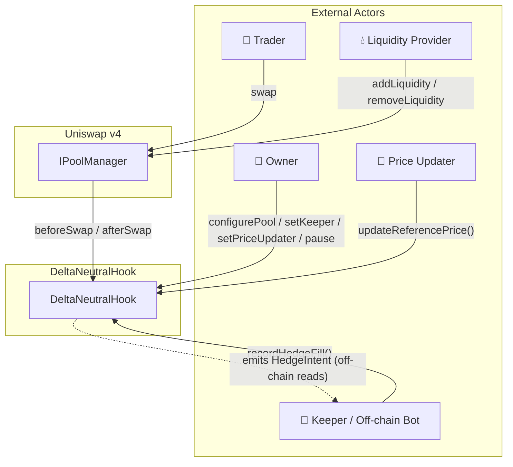

---

### Step 2 · Data Model

The two core structs that live in storage for each pool.

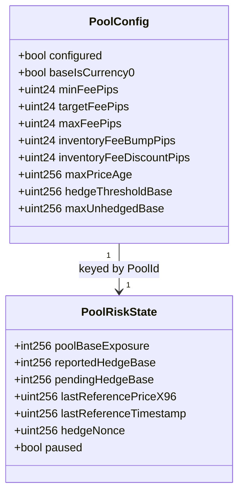

---

### Step 3 · Hook Permissions

Which Uniswap v4 callback slots this contract occupies.

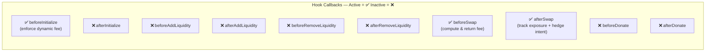

> **Key observation:** liquidity callbacks are stubs — the hook does *not* track who adds or removes liquidity.

---

### Step 4 · Swap Flow

The full path from a trader's swap to the hedge signal.

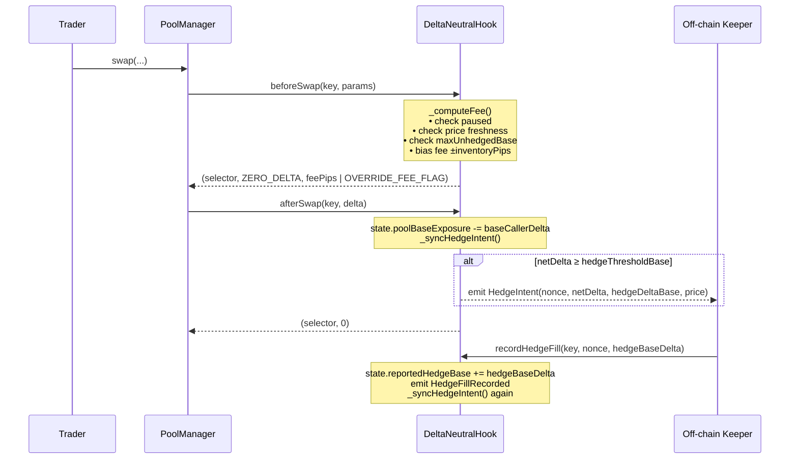

---

### Step 5 · Dynamic Fee Logic

How the fee pivots around `targetFeePips` based on inventory direction.

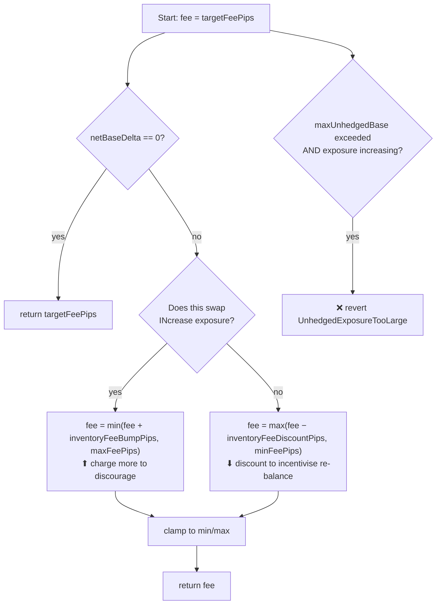

---

### Step 6 · Hedge Intent Lifecycle (v1)

The complete loop from swap → keeper fill → acknowledgement.

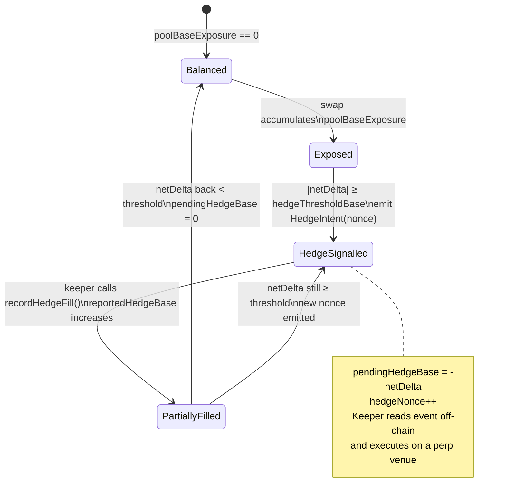

---

## Part 2 — Upgrade Gap

### Step 7 · What Changed Between v1 → Production

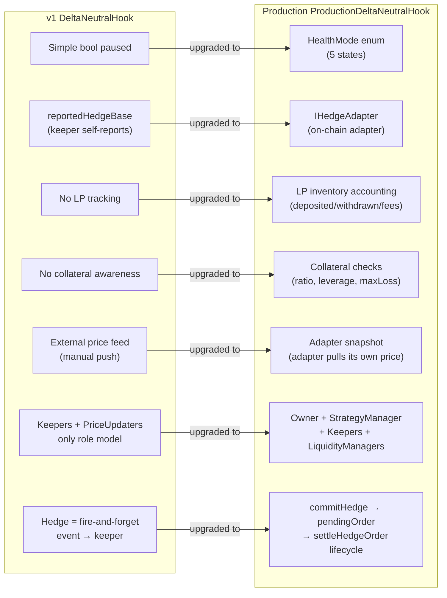

---

## Part 3 — `ProductionDeltaNeutralHook` (v2)

### Step 8 · High-Level Actor Map

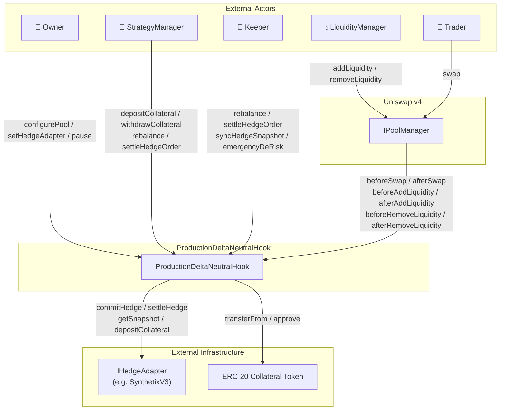

---

### Step 9 · Extended Data Model

New fields added on top of v1's config + risk state.

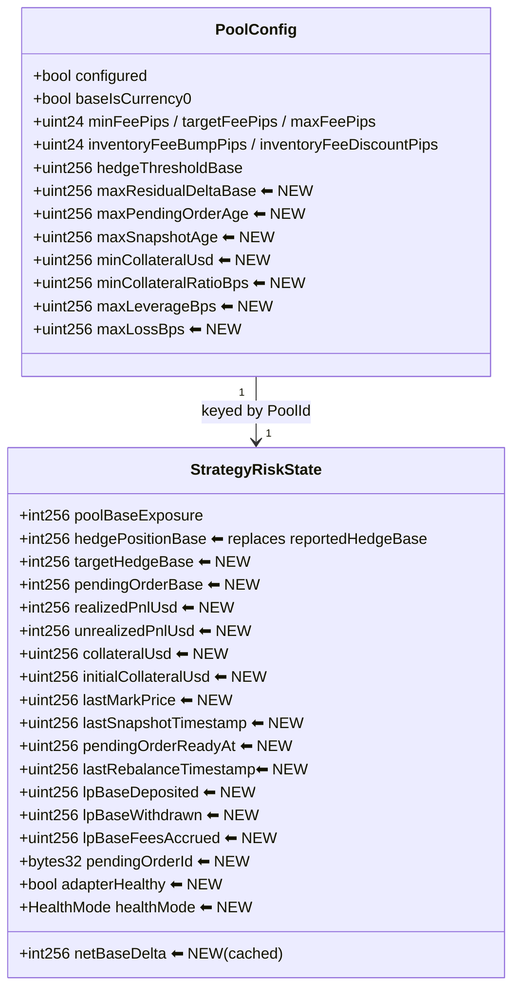

---

### Step 10 · Hook Permissions

All six swap + liquidity callbacks are now active.

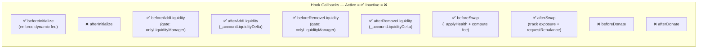

---

### Step 11 · HealthMode State Machine

The core upgrade: a five-state finite state machine that governs the pool's behaviour.

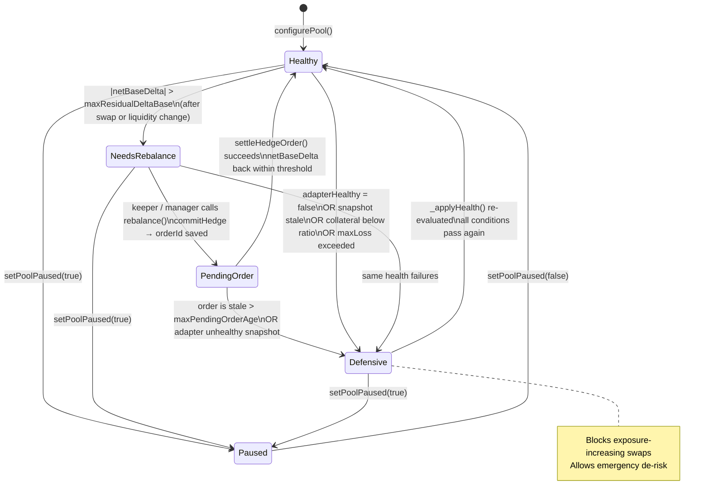

---

### Step 12 · Swap Flow (Production)

Extended with health checks, LP inventory sync, and on-chain rebalance signalling.

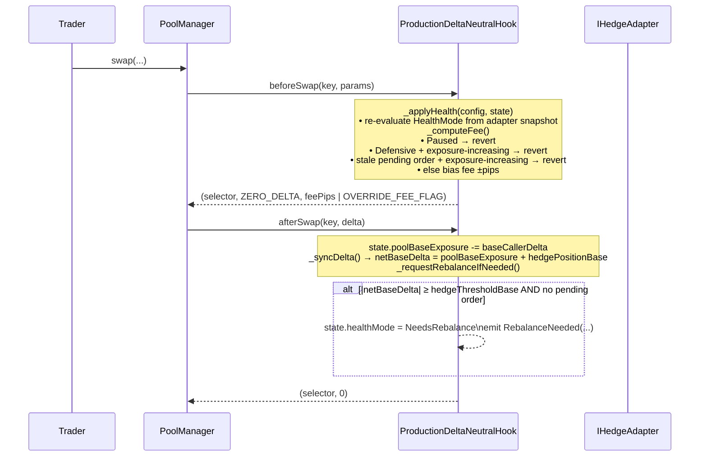

---

### Step 13 · LP Inventory Accounting

New in Production — the hook tracks every base-token unit that enters or leaves via liquidity.

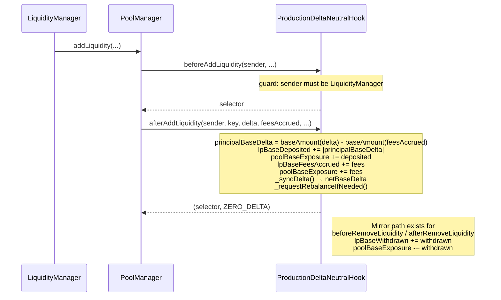

---

### Step 14 · On-Chain Hedge Order Lifecycle

The full round-trip from rebalance signal through to settled hedge position.

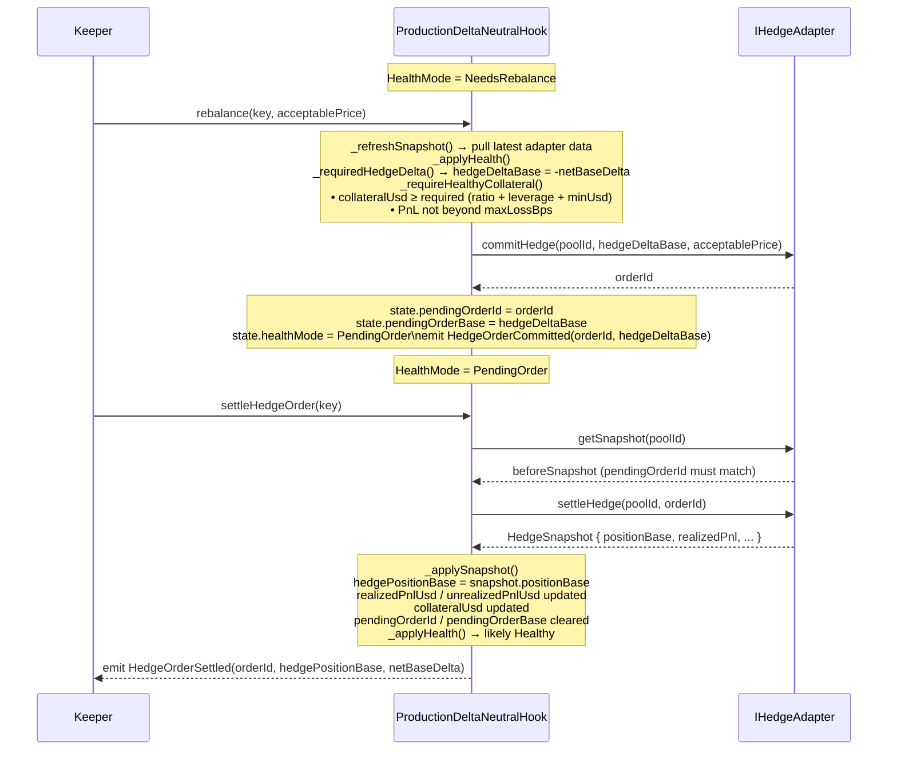

---

### Step 15 · Collateral & Risk Guard System

The multi-layer safety net introduced in Production.

```mermaid
flowchart TD
    A[rebalance() called] --> B[_refreshSnapshot from Adapter]
    B --> C{adapterHealthy?}
    C -->|no| ERR1["❌ revert HedgeAdapterUnhealthy"]
    C -->|yes| D{snapshot stale?\nblock.timestamp > lastSnapshotTimestamp\n+ maxSnapshotAge}
    D -->|yes| ERR1
    D -->|no| E[_requiredCollateralUsd]

    E --> F["projectedExposure = |hedgePosition + delta|"]
    F --> G["notionalUsd = projectedExposure × lastMarkPrice / 1e18"]
    G --> H["ratioRequired = notionalUsd × minCollateralRatioBps / 10000\nleverageRequired = notionalUsd × 10000 / maxLeverageBps\nrequiredUsd = max(minCollateralUsd, ratioRequired, leverageRequired)"]
    H --> I{collateralUsd ≥ requiredUsd?}
    I -->|no| ERR2["❌ revert InsufficientCollateral"]
    I -->|yes| J[_checkMaxLoss]
    J --> K{"PnL < -(initialCollateral × maxLossBps / 10000)?"}
    K -->|yes| ERR3["❌ revert MaxLossExceeded"]
    K -->|no| OK["✅ proceed to commitHedge"]
```

---

### Step 16 · Emergency De-Risk

A bypass path for when the position needs to be closed immediately regardless of normal flow.

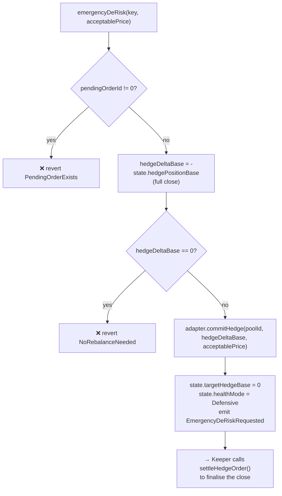

---

## Summary — v1 vs Production Side-by-Side

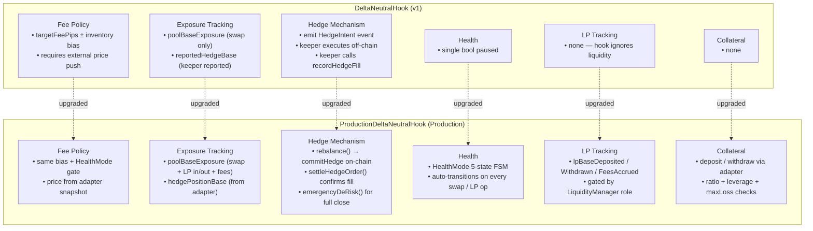
